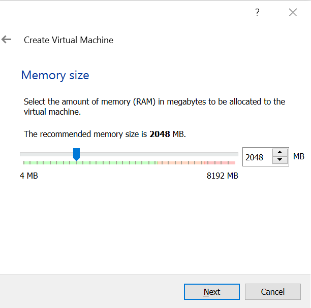

# amFOSS Tasks Freshers 2020

# Task-0

I felt that dual booting Ubuntu would make my system slow, so I have installed a Virtual Machine on my Windows 10 and then installed Ubuntu 20.04 in the VM. I chose Oracle's Virtual Box VM since it's the most used and most importantly it's open source. In the following, I explain the whole task in sequential steps.

- **Step-1:** Install Virtual Box from https://www.virtualbox.org/wiki/Downloads choose your platform and download the corresponding executable file.
- **Step-2:** Run the executable file and open it.
- **Step-3:** Click on New button, a window pops out which asks you to choose the name, machine type and version of the OS that you want to install to the VM.
    > *Name:* Choose the desired name (ex: Ubuntu-VB).  
    > *Machine Folder:* Browse the directory you want the VM to be present.  
    > *Type:* The type of OS (ex: Windows, Linux etc...). I chose Linux since Ubuntu is one of the Linux distributions.  
    > *Version:* Ubuntu (64bit).
    
- **Step-4:** Then it asks for the RAM requirements. I have given 2048MB(~2GB).
    
- **Step-5:** Later it asks for the Hard disk file type. Choose VDI.

    
- **Step-6:** Then choose physical hard disk, dynamically allocated is recommended. And next choose the hard disk location and the required size.
    
    
- **Step-7:** Now you can see that a new VM by name *Ubuntu-VB* is created. Now you can run the VM by simply double clicking it. 
    
- **Step-8:** As you would be starting the VM for the first time it asks you to select a medium to install the OS. Before moving further, you have to download an ISO image file from https://ubuntu.com/#download. Once the ISO image is downloaded, go to the *Storage* tab inside the *Ubuntu-VB* settings. 
    
- **Step-9:** Navigate to the Empty button and select as shown in the below fig. Then you can browse the downloaded ISO image file and select it. Now the Ubuntu OS will be installed inside the VM as soon as you start it.
    

**References:**  
https://www.youtube.com/watch?v=x5MhydijWmc  
https://www.virtualbox.org/manual/ch01.html  
https://askubuntu.com/questions/142549/how-to-install-ubuntu-on-virtualbox  

